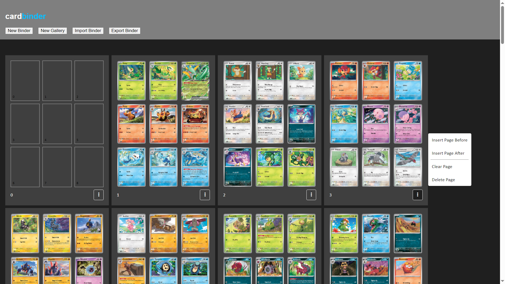

# cardbinder

Try this out at: https://katsuroom.github.io/cardbinder/

Create binder page layouts for trading cards. Made with React + Vite.

Uses Font Awesome: https://fontawesome.com/download



## How to Use

```
cd client

npm run dev
npm run build
```

Static HTML will be built in `/client/dist`.

Copy an online image and paste it into one of the card slots. Click "Export Binder" to download a file containing your binder data, and press "Import Binder" to load a binder file from your computer.

## Features

### Modes
- Binder: Creates lower resolution images for planning binder layouts.
- Gallery: Creates higher resolution images for displaying cards with text descriptions.
- Once a binder has been created with a selected mode, it cannot be changed.

### Card Slot Actions
- CTRL+C / CTRL+X on a card slot to copy/cut to the clipboard.
- CTRL+V to paste an image or copied card slot.
- DELETE to clear.
- Drag a card to move to another space, or swap with another card.
- _(Gallery Mode only)_: Double click the text below a card to edit the card description.

### Card Page Actions
- CTRL+C to copy all 9 cards to the clipboard.
- CTRL+V to paste a copied page.
- DELETE to remove a page.
- Double click the text at the bottom of the page to edit the page description.
- Click on the button with three dots to open the context menu:
    - Insert a new page before the current page
    - Insert a new page after the current page
    - Clear all cards on the page
    - Delete the page